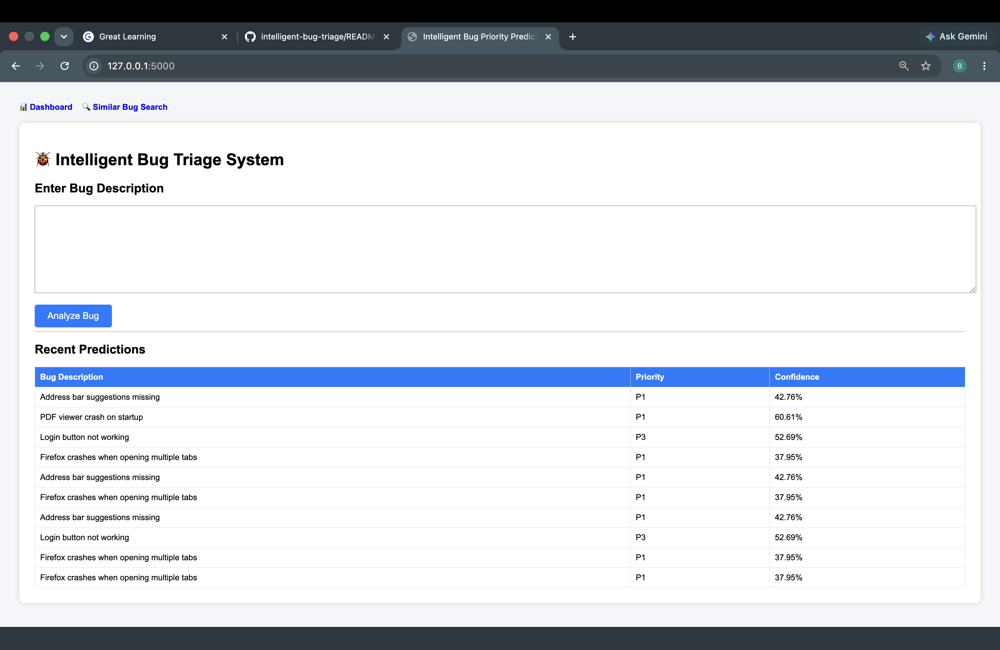
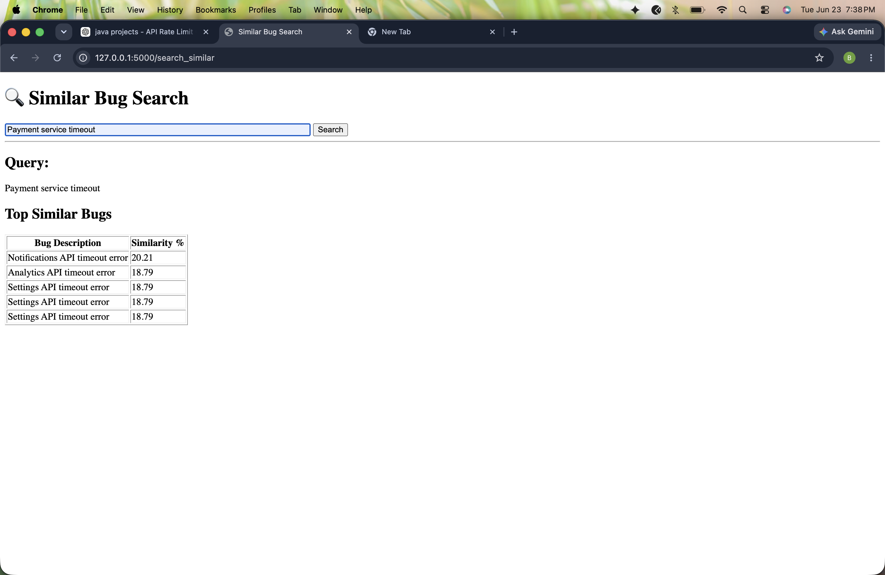
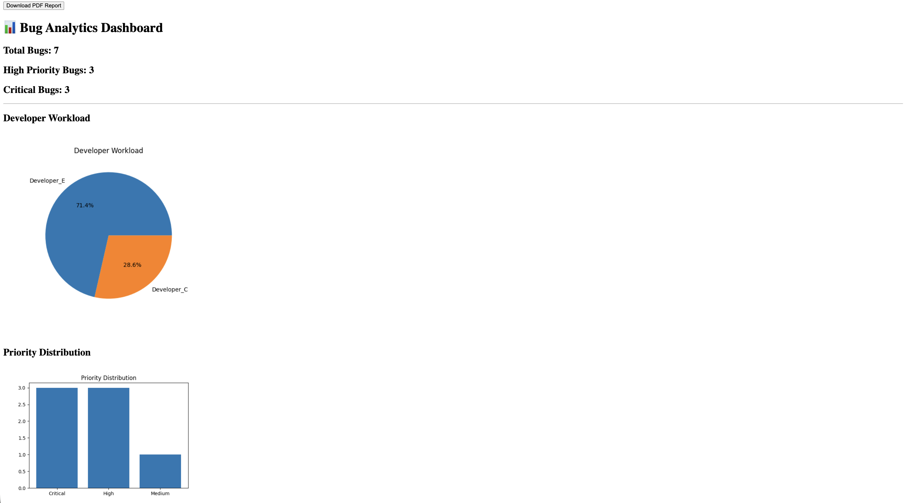

# 🐞 Intelligent Bug Triage System

An AI-powered web application that helps software teams analyze bug reports using Machine Learning.

The system predicts bug priority levels, finds similar historical bugs, generates analytics dashboards, and exports reports to improve bug management and triage processes.

---

## 🚀 Features

### Priority Prediction

Predicts the priority level of a bug report using a trained Machine Learning model.

Supported priorities:

* P1 (Critical)
* P2 (High)
* P3 (Medium)
* P4 (Low)
* P5 (Very Low)

### Similar Bug Search

Uses TF-IDF Vectorization and Cosine Similarity to identify the most similar historical bug reports.

### Duplicate Bug Detection

Detects whether a newly submitted bug is potentially a duplicate of an existing bug.

### Analytics Dashboard

Provides:

* Total predictions count
* Priority distribution
* Bug trend analytics
* Visual charts

### PDF Report Generation

Allows users to export bug analysis reports in PDF format.

### REST API Support

Provides API endpoints for integration with external applications.

---

# 🛠 Technologies Used

### Backend

* Python
* Flask

### Machine Learning

* Scikit-Learn
* TF-IDF Vectorizer
* LinearSVC (Support Vector Machine)

### Data Processing

* Pandas
* NumPy

### Visualization

* Matplotlib

### Reporting

* ReportLab

### Frontend

* HTML
* CSS
* Jinja2 Templates

---

# 📸 Screenshots

## Home Page



The main interface where users can enter bug descriptions and receive priority predictions.

---

## Similar Bug Search



Searches historical bug reports and returns the most similar bugs using machine learning similarity matching.

---

## Analytics Dashboard



Displays prediction statistics, priority distribution, and bug analytics.

---

# 📂 Project Structure

```text
intelligent-bug-triage/
│
├── app.py
├── requirements.txt
├── README.md
│
├── data/
│   ├── firefox_priority_dataset.csv
│   └── predictions.csv
│
├── models/
│   └── priority_model.pkl
│
├── screenshots/
│   ├── home-page.png
│   ├── dashboard.png
│   └── similar-bug-search.png
│
├── templates/
│   ├── index.html
│   ├── dashboard.html
│   └── similar.html
│
├── static/
│   └── priority_chart.png
│
├── duplicate_detector.py
├── similarity_search.py
├── train_priority.py
├── train_priority_svm.py
├── evaluate.py
└── evaluate_svm.py
```

---

# ⚙️ Installation

Clone the repository:

```bash
git clone https://github.com/BinduSamaseni2005/intelligent-bug-triage.git
```

Move into the project directory:

```bash
cd intelligent-bug-triage
```

Install dependencies:

```bash
pip install -r requirements.txt
```

Run the application:

```bash
python app.py
```

Open your browser:

```text
http://127.0.0.1:5000
```

---

# 🔗 Application Routes

| Route           | Description             |
| --------------- | ----------------------- |
| /               | Home Page               |
| /predict        | Predict Bug Priority    |
| /similar        | Similar Bug Search Page |
| /search_similar | Search Similar Bugs     |
| /dashboard      | Analytics Dashboard     |
| /export_pdf     | Download PDF Report     |

---

# 🤖 Machine Learning Workflow

1. Load historical bug dataset.
2. Preprocess bug descriptions.
3. Convert text into TF-IDF vectors.
4. Train SVM-based priority prediction model.
5. Predict priority for new bug reports.
6. Detect duplicate bugs using cosine similarity.
7. Find similar bugs from historical records.
8. Visualize analytics through dashboard charts.

---

# 📊 Model Performance

The priority prediction model was trained using a Firefox bug dataset and evaluated using classification metrics including:

* Precision
* Recall
* F1-Score
* Accuracy

The final model achieved approximately **65% classification accuracy** using a LinearSVC classifier.

---

# 🔮 Future Enhancements

* Jira Integration
* GitHub Issues Integration
* Deep Learning-Based Classification (BERT)
* Real-Time Notifications
* Multi-Project Support
* Advanced Analytics Dashboard

---

# 👩‍💻 Author

**Bindu Reddy**

M.Tech Computer Science and Engineering

Vellore Institute of Technology (VIT)

GitHub: https://github.com/BinduSamaseni2005
